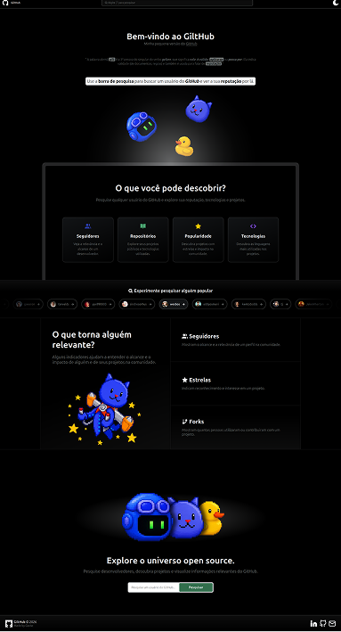

<div align=left>

<h1 align="right">Bem-vindo ao GiltHub</h1>
</div>

> Explore perfis e repositórios do GitHub através de uma interface moderna, responsiva e otimizada.


🌐 **Demo:** https://gilthub.vercel.app/

---

## 📖 Sobre o Projeto

O **GiltHub** é uma aplicação web desenvolvida com **HTML, CSS e JavaScript puro** que consome a API pública do GitHub para pesquisar usuários e explorar seus repositórios de forma rápida e intuitiva.

O principal objetivo deste projeto foi colocar em prática conceitos essenciais do desenvolvimento Frontend moderno, indo além da construção de interfaces estáticas. Durante o desenvolvimento, foram aplicados conhecimentos relacionados a consumo de APIs, programação assíncrona, tratamento de erros, cache, persistência de dados e otimização da experiência do usuário.

Além de servir como ferramenta de consulta ao GitHub, este projeto representa minha evolução prática como desenvolvedor Frontend e meu aprofundamento nos fundamentos da plataforma web.

---

## ✨ Funcionalidades

- 🔍 Pesquisa de usuários do GitHub
- 👤 Exibição de informações detalhadas do perfil
- 📚 Listagem de repositórios públicos
- 📄 Paginação de repositórios
- 🌙 Dark Mode com persistência da preferência do usuário
- 💾 Persistência de dados utilizando LocalStorage
- ⚡ Sistema de cache para otimização de requisições
- 🚨 Tratamento de erros e feedback visual
- 📱 Interface totalmente responsiva
- 🔄 Atualização dinâmica da interface sem recarregamento da página

---

## 🖼️ Preview

### Desktop

<div align="center">

</div>

### Mobile

<div align="center">

</div>

---

## 🛠️ Tecnologias Utilizadas

### Frontend

- HTML5
- CSS3
- JavaScript (ES6+)

### APIs

- GitHub REST API

### Armazenamento

- LocalStorage

### Deploy

- Vercel

---

## 🧠 Conceitos Aplicados

### Consumo de APIs REST

Integração com a API pública do GitHub para obtenção de dados em tempo real.

### Programação Assíncrona

Utilização de Promises, Async/Await e Fetch API para gerenciar operações assíncronas de forma clara e eficiente.

### Fetch API

Realização de requisições HTTP utilizando recursos nativos do navegador.

### Tratamento de Erros

Implementação de estratégias para lidar com cenários reais como:

- Usuários inexistentes
- Falhas de conexão
- Limites de requisição da API
- Respostas inesperadas

### Cache

Armazenamento temporário de dados para reduzir chamadas repetidas à API e melhorar a performance da aplicação.

### Persistência de Dados

Utilização do LocalStorage para armazenar preferências e informações relevantes entre sessões.

### Paginação

Implementação de paginação para melhorar a navegação e organização dos repositórios retornados pela API.

### Manipulação do DOM

Atualização dinâmica dos elementos da interface utilizando JavaScript puro.

### Responsividade

Desenvolvimento de layouts adaptáveis para desktop, tablet e dispositivos móveis.

### UX/UI

Aplicação de boas práticas de experiência do usuário, incluindo:

- Feedback visual
- Estados de carregamento
- Mensagens de erro amigáveis
- Tema escuro
- Navegação intuitiva

---

## 🏗️ Arquitetura e Decisões Técnicas

### Por que JavaScript puro?

Este projeto foi desenvolvido sem frameworks com o objetivo de fortalecer minha compreensão dos fundamentos da linguagem e dos mecanismos nativos da web.

Essa abordagem permitiu aprofundar conhecimentos em:

- Manipulação do DOM
- Programação assíncrona
- Gerenciamento de estado
- Estruturação de código
- Integração com APIs externas

### Por que implementar cache?

A API do GitHub possui limites de requisição. O uso de cache reduz chamadas desnecessárias, melhora a performance da aplicação e proporciona uma experiência mais fluida ao usuário.

### Por que persistir dados?

A persistência melhora a experiência do usuário ao manter preferências e informações relevantes mesmo após recarregar a página.

### Por que tratar erros explicitamente?

Aplicações reais precisam lidar com falhas de rede, indisponibilidade de serviços e entradas inválidas. O tratamento adequado desses cenários torna a aplicação mais robusta e previsível.

---

## 🎯 O que este Projeto Demonstra

Este projeto evidencia minha capacidade de:

- Consumir APIs REST reais
- Trabalhar com programação assíncrona
- Utilizar Promises e Async/Await
- Estruturar aplicações em JavaScript puro
- Implementar persistência de dados
- Aplicar estratégias de cache
- Criar interfaces responsivas
- Desenvolver funcionalidades focadas em experiência do usuário
- Resolver problemas comuns encontrados em aplicações Frontend modernas

---

## 📈 Aprendizados

Durante o desenvolvimento do GiltHub, aprofundei meus conhecimentos em:

- JavaScript moderno (ES6+)
- Promises
- Async/Await
- Fetch API
- Consumo de APIs REST
- Tratamento de erros
- Cache de dados
- Persistência com LocalStorage
- Manipulação de DOM
- Responsividade
- Organização de código
- Boas práticas de UX/UI

---

## 🚀 Como Executar Localmente

Clone o repositório:

```bash
git clone https://github.com/Cavisc/gilthub.git
```

Acesse a pasta do projeto:

```bash
cd gilthub
```

Abra o arquivo `index.html` no navegador ou utilize uma extensão como:

- Live Server (VS Code)

---

## 📂 Estrutura do Projeto

```text
gilthub/
├── favicon/
├── src/
│   ├── assets/
│   ├── scripts/
│   └── styles/
├── index.html
└── README.md
```

---

## 🔮 Possíveis Melhorias Futuras

- Pesquisa avançada de repositórios
- Filtros por linguagem
- Ordenação por estrelas, forks e data
- Infinite Scroll
- Integração com GitHub GraphQL API
- Testes automatizados
- Migração para React
- Transformação em Progressive Web App (PWA)

---

## 👨‍💻 Autor

**Carlos Coelho**

Estudante de Ciência da Computação e desenvolvedor Frontend em formação, focado em JavaScript, React e desenvolvimento de aplicações web modernas.

### Contato

- GitHub: https://github.com/Cavisc
- LinkedIn: https://www.linkedin.com/in/carlos-vinícius-de-souza-coelho-717651212

---

<div align="center">
<h3><i>Algumas imagens foram geradas por IA</i></h3>
</div>
